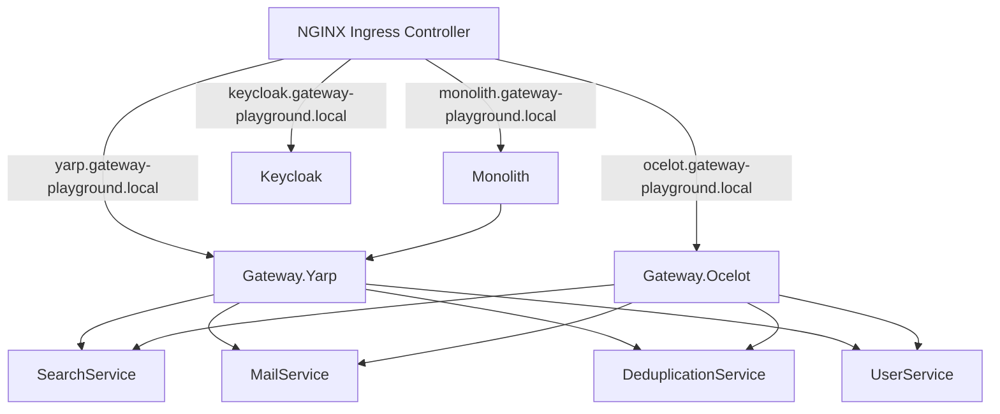

# Kubernetes Deployment

Kubernetes manifests live under `k8s/` and are built with Kustomize.

```text
k8s/
  base/
    namespace.yaml
    configmaps.yaml
    secrets.yaml
    keycloak.yaml
    gateway-yarp.yaml
    gateway-ocelot.yaml
    monolith.yaml
    *-service.yaml
    ingress.yaml
    kustomization.yaml
  overlays/
    local/
      kustomization.yaml
```

## Architecture



The business services are `ClusterIP` only. They are not exposed through Ingress because the Mode B security model makes them trust `Gateway.Yarp`.

## Prerequisites

- Kubernetes cluster.
- `kubectl` with Kustomize support.
- NGINX Ingress Controller installed and exposing an `IngressClass` named `nginx`.
- Container images built and available to the cluster.

Check the ingress class:

```powershell
kubectl get ingressclass
```

For local clusters, install or enable NGINX Ingress using the mechanism for your cluster:

```powershell
# Minikube
minikube addons enable ingress

# Helm-based clusters
helm repo add ingress-nginx https://kubernetes.github.io/ingress-nginx
helm repo update
helm upgrade --install ingress-nginx ingress-nginx/ingress-nginx `
  --namespace ingress-nginx `
  --create-namespace
```

## Build Images

From the repository root:

```powershell
docker build -f src/Gateway.Yarp/Dockerfile -t gatewayplayground-gateway-yarp:latest .
docker build -f src/Gateway.Ocelot/Dockerfile -t gatewayplayground-gateway-ocelot:latest .
docker build -f src/Monolith/Dockerfile -t gatewayplayground-monolith:latest .
docker build -f src/SearchService/Dockerfile -t gatewayplayground-searchservice:latest .
docker build -f src/MailService/Dockerfile -t gatewayplayground-mailservice:latest .
docker build -f src/DeduplicationService/Dockerfile -t gatewayplayground-deduplicationservice:latest .
docker build -f src/UserService/Dockerfile -t gatewayplayground-userservice:latest .
```

For Docker Desktop Kubernetes, these images are already available to the cluster. For `kind` or `minikube`, load them explicitly:

```powershell
# kind
kind load docker-image gatewayplayground-gateway-yarp:latest
kind load docker-image gatewayplayground-gateway-ocelot:latest
kind load docker-image gatewayplayground-monolith:latest
kind load docker-image gatewayplayground-searchservice:latest
kind load docker-image gatewayplayground-mailservice:latest
kind load docker-image gatewayplayground-deduplicationservice:latest
kind load docker-image gatewayplayground-userservice:latest

# minikube
minikube image load gatewayplayground-gateway-yarp:latest
minikube image load gatewayplayground-gateway-ocelot:latest
minikube image load gatewayplayground-monolith:latest
minikube image load gatewayplayground-searchservice:latest
minikube image load gatewayplayground-mailservice:latest
minikube image load gatewayplayground-deduplicationservice:latest
minikube image load gatewayplayground-userservice:latest
```

## Deploy

Render first:

```powershell
kubectl kustomize k8s/overlays/local
```

Apply:

```powershell
kubectl apply -k k8s/overlays/local
```

Wait for workloads:

```powershell
kubectl -n gateway-playground rollout status deploy/keycloak
kubectl -n gateway-playground rollout status deploy/search-service
kubectl -n gateway-playground rollout status deploy/mail-service
kubectl -n gateway-playground rollout status deploy/deduplication-service
kubectl -n gateway-playground rollout status deploy/user-service
kubectl -n gateway-playground rollout status deploy/gateway-yarp
kubectl -n gateway-playground rollout status deploy/gateway-ocelot
kubectl -n gateway-playground rollout status deploy/monolith
```

Check resources:

```powershell
kubectl -n gateway-playground get pods,svc,ingress
```

## Local DNS

For local clusters, map the ingress address to these hosts:

```text
yarp.gateway-playground.local
ocelot.gateway-playground.local
monolith.gateway-playground.local
keycloak.gateway-playground.local
```

If your ingress address is `127.0.0.1`, add this to `hosts`:

```text
127.0.0.1 yarp.gateway-playground.local ocelot.gateway-playground.local monolith.gateway-playground.local keycloak.gateway-playground.local
```

Otherwise get the address:

```powershell
kubectl -n gateway-playground get ingress gateway-playground
```

## Validate Security

Get a `User` token:

```powershell
$tokenResponse = Invoke-RestMethod `
  -Method Post `
  -Uri "http://keycloak.gateway-playground.local/realms/gateway-playground/protocol/openid-connect/token" `
  -ContentType "application/x-www-form-urlencoded" `
  -Body @{
    client_id = "gateway-playground-api"
    grant_type = "password"
    username = "testuser"
    password = "testuser"
  }

$userToken = $tokenResponse.access_token
```

Get an `Admin` token:

```powershell
$tokenResponse = Invoke-RestMethod `
  -Method Post `
  -Uri "http://keycloak.gateway-playground.local/realms/gateway-playground/protocol/openid-connect/token" `
  -ContentType "application/x-www-form-urlencoded" `
  -Body @{
    client_id = "gateway-playground-api"
    grant_type = "password"
    username = "admin"
    password = "admin"
  }

$adminToken = $tokenResponse.access_token
```

Expected outcomes:

```powershell
# No token -> 401
Invoke-WebRequest -Uri "http://yarp.gateway-playground.local/api/search/info"

# Valid User token -> 200
Invoke-RestMethod `
  -Uri "http://yarp.gateway-playground.local/api/search/info" `
  -Headers @{ Authorization = "Bearer $userToken" }

# User token on Admin route -> 403
Invoke-WebRequest `
  -Uri "http://yarp.gateway-playground.local/api/search/admin" `
  -Headers @{ Authorization = "Bearer $userToken" }

# Admin token on Admin route -> 200
Invoke-RestMethod `
  -Uri "http://yarp.gateway-playground.local/api/search/admin" `
  -Headers @{ Authorization = "Bearer $adminToken" }
```

## Kustomize Customization

Update image names or tags in `k8s/overlays/local/kustomization.yaml`.

For another environment, create a new overlay:

```text
k8s/overlays/staging/kustomization.yaml
k8s/overlays/production/kustomization.yaml
```

Typical production overrides:

- Use registry-qualified images.
- Replace `keycloak-bootstrap-secret`.
- Use HTTPS ingress and TLS secrets.
- Replace `.gateway-playground.local` hosts.
- Run Keycloak with a production database instead of `start-dev`.
- Increase replicas and add resource requests/limits.

## Cleanup

```powershell
kubectl delete -k k8s/overlays/local
```

## Security Notes

- Do not expose `search-service`, `mail-service`, `deduplication-service`, or `user-service` through Ingress.
- `Gateway.Yarp` is the security boundary for Mode B.
- Services trust `X-Gateway-*` headers only because they are private behind the gateway.
- The bundled Keycloak secret uses development credentials. Replace it before using any shared environment.
- The Keycloak deployment is intentionally lightweight and does not include persistent storage or an external database.
