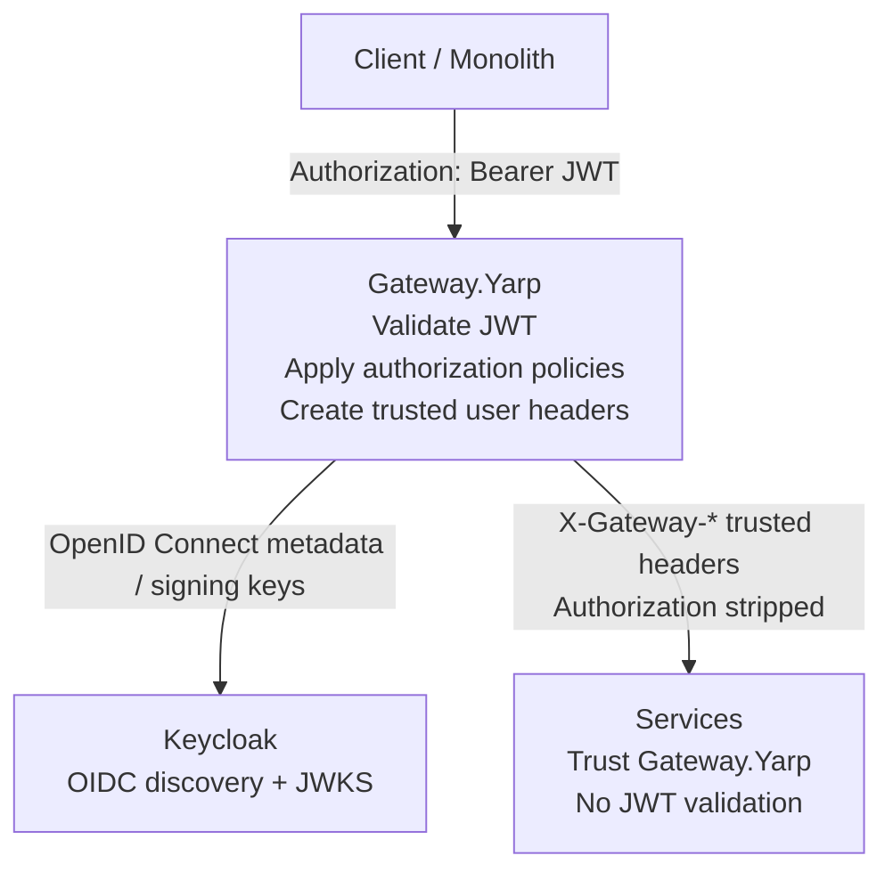
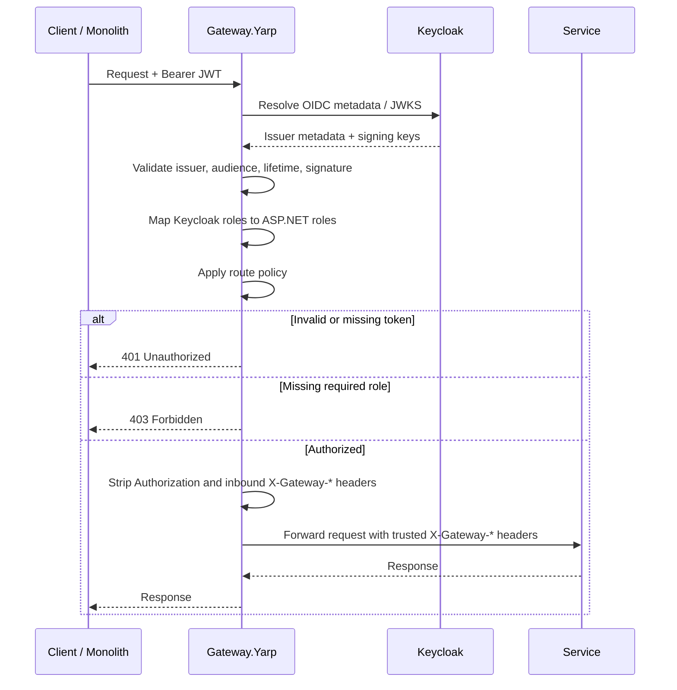

# Gateway.Yarp Security Model

## Target Model

In this model, `Gateway.Yarp` owns authentication and coarse-grained route authorization. Services do not validate JWTs and must not be exposed directly outside the trusted network.

## Security Flow

## Policies

| Route | Policy | Allowed roles |
| --- | --- | --- |
| `/api/search/**` | `UserOrAdmin` | `User`, `Admin` |
| `/api/mail/**` | `UserOrAdmin` | `User`, `Admin` |
| `/api/deduplication/**` | `UserOrAdmin` | `User`, `Admin` |
| `/api/users/**` | `UserOrAdmin` | `User`, `Admin` |
| `/api/search/admin/**` | `AdminOnly` | `Admin` |
| `/api/mail/admin/**` | `AdminOnly` | `Admin` |
| `/api/deduplication/admin/**` | `AdminOnly` | `Admin` |
| `/api/users/admin/**` | `AdminOnly` | `Admin` |

## Downstream Claims

`Gateway.Yarp` removes spoofable inbound identity headers and writes these trusted headers after JWT validation:

| Header | Meaning |
| --- | --- |
| `X-Gateway-Authenticated` | Always `true` for authorized proxied requests |
| `X-Gateway-User-Id` | JWT `sub` claim |
| `X-Gateway-User-Name` | `preferred_username` or name claim |
| `X-Gateway-Roles` | Comma-separated mapped ASP.NET roles |
| `X-Gateway-Claims` | Base64url-encoded JSON array of token claims |

`Authorization` is stripped before forwarding to services. Tokens are not propagated downstream in this trust model.

## Pros

- Centralized JWT validation and route-level authorization.
- Services are simpler and do not need Keycloak/OIDC configuration.
- Keycloak outages or JWKS refresh issues are isolated to the gateway layer.
- Downstream services do not receive bearer tokens, reducing token leakage risk.
- Gateway can enforce consistent `401` and `403` behavior before traffic reaches services.

## Cons

- Direct service exposure becomes a critical vulnerability because services trust headers.
- A compromised gateway can impersonate any user to downstream services.
- Fine-grained domain authorization still needs a design, otherwise gateway policies may become too coarse.
- Service-to-service calls need a separate trust model if they bypass Gateway.Yarp.
- Debugging authorization decisions moves away from services and into gateway logs/config.

## Operational Implications

- Services must be private: Docker/internal network only, firewall rules, no public ingress.
- In Kubernetes, downstream services must stay `ClusterIP`; expose only `Gateway.Yarp` through Ingress for Mode B traffic.
- Any inbound `X-Gateway-*` headers must be overwritten by Gateway.Yarp, never trusted from clients.
- Gateway.Yarp must be monitored as a security boundary: auth failures, forbidden responses, JWKS refresh, Keycloak latency.
- Scaling Gateway.Yarp now scales the auth decision point.
- Blue/green deployments must keep policies and route changes synchronized.
- If a service needs resource-level authorization, pass only verified identity context from Gateway.Yarp and implement domain checks in the service without revalidating JWT.
- Production should prefer mTLS or service identity between Gateway.Yarp and services.
